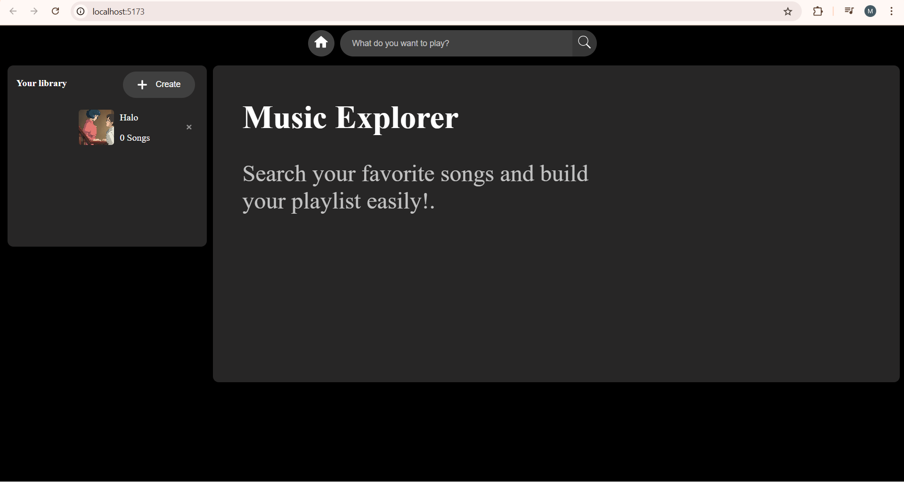
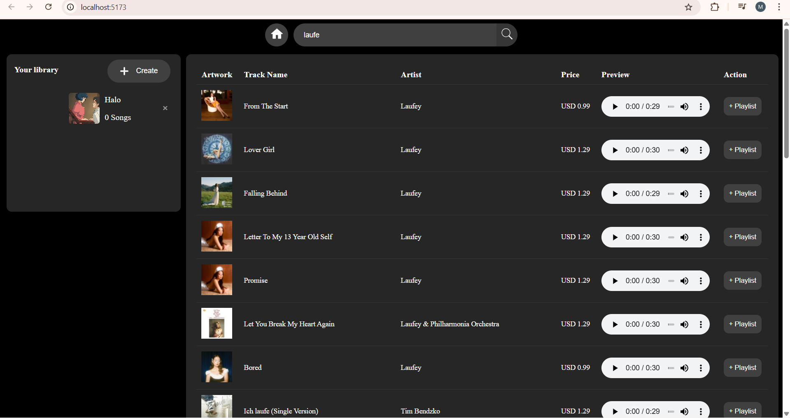

# music explorer

Proyek Ujian Tengah Semester (UTS) mata kuliah Pemrograman Web.

- **Nama:** Muhammad Daffansyah Desuandi
- **NIM:** 123140127

---

## Link Deployment (Vercel)

Aplikasi ini telah di-deploy dan dapat diakses secara publik melalui link berikut:

**https://utsdaffansyah123140127.vercel.app/**

---

## Deskripsi

**Music Explorer** Aplikasi web front-end yang dibangun dengan React dan di-bundle menggunakan Vite untuk eksplorasi dan manajemen daftar putar (playlist). Pengguna dapat mencari lagu, melihat detailnya, membuat daftar putar, dan mengelola koleksi mereka.

## Fitur Utama
- **Pencarian dan Tampilan Hasil Lagu:** Fitur ini memungkinkan pengguna menemukan konten dan menampilkan hasilnya dalam format yang terstruktur.
- **Manajemen Library Playlist:** Fitur ini mengatur, menampilkan, dan mengelola koleksi daftar putar pengguna.
- **Menambahkan Lagu ke Playlist :** Ini adalah fitur interaksi utama yang menghubungkan hasil pencarian dengan koleksi playlist pengguna.
- **Desain Responsif:** Pengguna dapat menggunakan tampilan mobile
- **Penyimpanan Lokal:** Daftar playlist disimpan di `localStorage` browser, sehingga data favorit pengguna tidak akan hilang bahkan setelah me-refresh atau menutup halaman.

## Teknologi yang Digunakan

- **Framework:** React.js (dibuat menggunakan Vite)
- **State Management:** React Hooks (`useState`, `useEffect`)
- **Styling:** CSS Modules
- **HTTP Client:** Fetch API (untuk berinteraksi dengan Met Museum API)
- **Penyimpanan:** LocalStorage

## Cara Instalasi dan Menjalankan Proyek

Jika Anda ingin menjalankan proyek ini di komputer lokal Anda, ikuti langkah-langkah berikut:

1.  **Clone repository ini:**
    ```bash
    git clone [MASUKKAN_URL_GIT_REPOSITORY_ANDA_DI_SINI]
    ```

2.  **Masuk ke direktori proyek:**
    ```bash
    cd [NAMA_FOLDER_PROYEK_ANDA]
    ```

3.  **Install semua dependencies:**
    ```bash
    npm install
    ```

4.  **Jalankan aplikasi di mode development:**
    ```bash
    npm run dev
    ```

5.  Buka `http://localhost:5173` (atau port yang tertera di terminal Anda) di browser.

## Tampilan Aplikasi

Berikut adalah screenshot dari tampilan aplikasi:

**Halaman Beranda (Pencarian)**


**Halaman pencarian**

